<!-- Artwork in /assets is generated by scripts/generate.py; metrics refresh daily via .github/workflows/profile.yml -->

<picture>
  <source media="(prefers-color-scheme: dark)" srcset="assets/header-dark.svg">
  
</picture>

  

  
  
  
  

<a href="README.md">English</a> · <b>Español</b>

 

### ◆ Sobre mí

<picture>
  <source media="(prefers-color-scheme: dark)" srcset="assets/about-dark.svg">
  
</picture>

Soy desarrollador de software en **Indra Espacio** y me gusta convertir ideas en herramientas que la gente usa de verdad. Mi día a día transcurre entre servicios **Java / Spring Boot** e interfaces **Angular / TypeScript**. Fuera del trabajo construyo productos de principio a fin: aplicaciones de escritorio en Python, apps móviles que funcionan sin conexión y todo lo que hay entre medias.

| &nbsp;Ahora | &nbsp;Siguiente paso | &nbsp;Siempre |
|:--|:--|:--|
| Desarrollando software empresarial en Indra Espacio | Profundizar en Spring Boot 3, Angular signals y AWS | Arquitectura limpia, código legible, tests automatizados |

 

### ◆ Proyectos destacados

<table>
  <tr>
    <td width="50%" valign="top">
      <a href="https://github.com/AdrianJimenezSantiago/mtg-forge">
        <picture>
          <source media="(prefers-color-scheme: dark)" srcset="assets/project-mtg-forge-dark.svg">
          
        </picture>
      </a>
    </td>
    <td width="50%" valign="top">
      <a href="https://github.com/AdrianJimenezSantiago/DnD-Grimoire">
        <picture>
          <source media="(prefers-color-scheme: dark)" srcset="assets/project-dnd-grimoire-dark.svg">
          
        </picture>
      </a>
    </td>
  </tr>
  <tr>
    <td align="center"><a href="https://github.com/AdrianJimenezSantiago/mtg-forge">Repositorio</a> · <a href="https://github.com/AdrianJimenezSantiago/mtg-forge/releases">Descargar</a></td>
    <td align="center"><a href="https://github.com/AdrianJimenezSantiago/DnD-Grimoire">Repositorio</a> · <a href="https://dnd-grimoire-five.vercel.app">Demo en vivo</a> · <a href="https://github.com/AdrianJimenezSantiago/DnD-Grimoire/releases/latest">Android APK</a></td>
  </tr>
</table>

<b>Proyectos anteriores</b>

 

- **AeroMatrix**: plataforma de gestión de flotas de drones. Frontend en React (Vite) y backend REST con Spring Boot.
- **Bookflix**: tienda online de libros digitales. Cliente React sobre una arquitectura cliente-servidor en C#.

 

### ◆ Cómo trabajo

<picture>
  <source media="(prefers-color-scheme: dark)" srcset="assets/principles-dark.svg">
  
</picture>

  

### ◆ Herramientas

  <picture>
    <source media="(prefers-color-scheme: dark)" srcset="https://skillicons.dev/icons?i=java,spring,cs,dotnet,python,fastapi,ts,js,angular,react,nextjs,vite,tailwind,html,css&perline=15&theme=dark">
    
  </picture>
   
  <picture>
    <source media="(prefers-color-scheme: dark)" srcset="https://skillicons.dev/icons?i=mysql,sqlite,git,github,githubactions,vercel,aws,linux,androidstudio,idea,vscode,postman&perline=15&theme=dark">
    
  </picture>

<b>Stack por capas</b>

 

| Capa | Tecnologías |
|:--|:--|
| **Backend** | Java · Spring Boot · Python · FastAPI · SQLAlchemy · C# / .NET |
| **Frontend** | TypeScript · Angular · React · Next.js · Alpine.js · Tailwind CSS |
| **Móvil y escritorio** | Capacitor (Android) · PWA · PyInstaller · pywebview |
| **Datos** | MySQL · SQLite (FTS5) · almacenamiento local en JSON |
| **Calidad** | GitHub Actions CI/CD · pytest · Ruff · mypy · ESLint · Robot Framework · Lighthouse CI |
| **Nube y despliegue** | Vercel · AWS · GitHub Releases |

 

### ◆ En cifras

<table>
  <tr>
    <td width="50%">
      <picture>
        <source media="(prefers-color-scheme: dark)" srcset="assets/generated/stats-dark.svg">
        
      </picture>
    </td>
    <td width="50%">
      <picture>
        <source media="(prefers-color-scheme: dark)" srcset="assets/generated/languages-dark.svg">
        
      </picture>
    </td>
  </tr>
</table>

<picture>
  <source media="(prefers-color-scheme: dark)" srcset="assets/generated/activity-dark.svg">
  
</picture>

Métricas propias, generadas a diario por <a href=".github/workflows/profile.yml">GitHub Actions</a> desde la API de GitHub. Sin servicios de terceros.

 

### ◆ Hablemos

Encantado de hablar sobre **desarrollo full-stack**, **software para el sector espacial** y proyectos interesantes.
La forma más rápida de contactarme es [LinkedIn](https://linkedin.com/in/ajimsan2009) o [email](mailto:ajimsan2096@gmail.com).

<picture>
  <source media="(prefers-color-scheme: dark)" srcset="assets/footer-dark.svg">
  
</picture>
